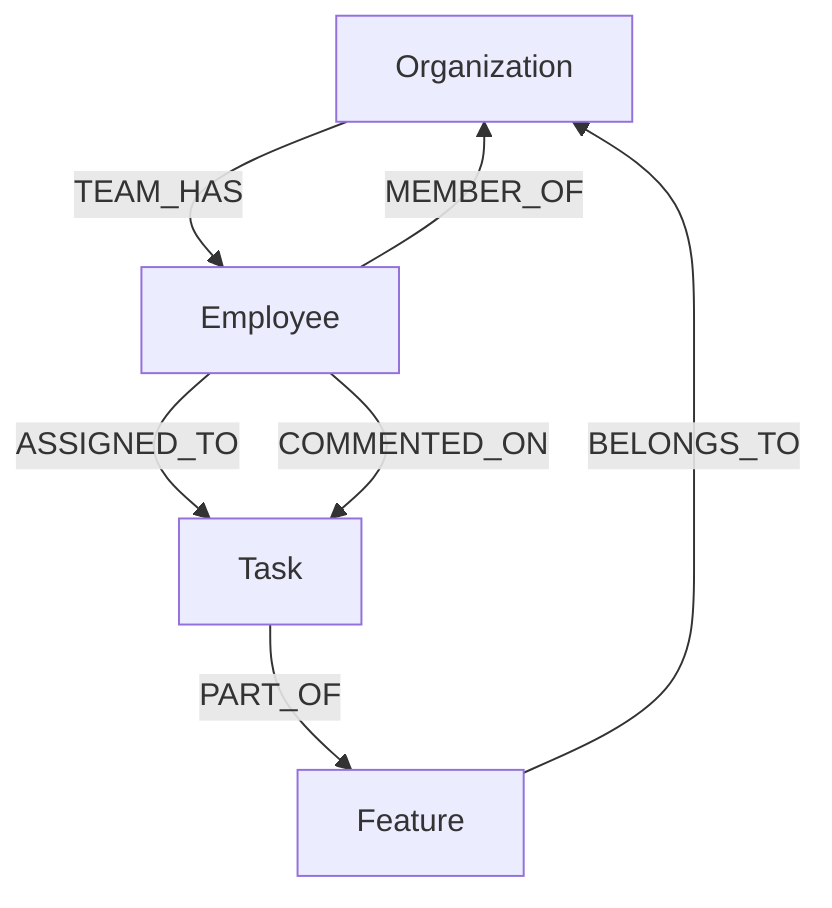

# Task Planner AI — AI-Powered Graph Database Project Intelligence

[](https://nextjs.org/)
[](https://cognodb.com/)
[](https://ai.google.dev/)
[](https://github.com/Yash-Goswami-2003/TaskPlanner)

**Task Planner AI** is a modern, minimalistic project management platform backed by **CognoDB** (a managed graph database speaking openCypher over Bolt) and powered by an **Agentic Google Gemini AI Assistant**.

* **Live Application Demo**: [https://task-planner-umber-two.vercel.app/](https://task-planner-umber-two.vercel.app/)
* **GitHub Repository**: [https://github.com/Yash-Goswami-2003/TaskPlanner](https://github.com/Yash-Goswami-2003/TaskPlanner)

---

## 🚀 Product Overview & Core Features

Task Planner AI combines a clean, Linear-inspired project dashboard with graph-backed intelligence to help teams collaborate, track tasks, and query work activity seamlessly.

### 1. Minimalist Monochromatic Dashboard
* **2-Column Task Grid**: Clean card layout displaying task titles, IDs (`TASK-713`), status pills (`To Do`, `In Progress`, `In Review`, `Done`), priority tags (`P1`–`P4`), stacked assignee avatars, and due dates.
* **Notion-Style Task Detail View**: Deep-dive into individual tasks to inspect full descriptions, assignees, timelines, and live discussion comment streams.
* **Team Directory View**: Browse workspace members, roles, and assigned workloads across the organization.

### 2. Conversational "Plan with AI" Assistant
* **Powered by Google Gemini 2.5 Flash**: Users can query project status, ask what team members are doing, or create new tasks using natural language.
* **Agentic Tool Calling**: Gemini acts as an intent router that calls secure backend tools (`search_tasks`, `get_user_activity`, `get_task_details`, `create_task`) to fetch real records from CognoDB.
* **Ultra-Concise Output**: Delivers executive 2–3 line bullet summaries with zero fluff or internal scratchpad leakage.

### 3. Multi-Tenant Graph Security & Auth
* **JWT Session Expiration**: 6-hour authenticated sessions backed by `localStorage` and HTTP cookies (`max-age=21600`).
* **Strict Organization Isolation**: The AI agent **never writes raw Cypher queries** or accesses the database directly. The backend automatically extracts `companyName` from the user's verified JWT token and binds `$companyName` to every query, ensuring total tenant isolation (`Wexa.ai`, `Acme Tech`, `Nexus FinTech`).

---

## 📐 Why a Graph Database for Project Planning?

In traditional relational databases (SQL), connecting employees, tasks, features, and comments requires writing multi-table `JOIN` queries across separate relational tables. 

In **Task Planner AI**, relationships are native graph edges:
* **Index-Free Adjacency**: Traversal between an `Employee`, their `ASSIGNED_TO` tasks, and their `COMMENTED_ON` activity follows direct memory pointers without expensive index lookups.
* **Rich Activity Mapping**: Instantly retrieve an employee's full workload, feature context, and discussion thread in a single openCypher query pattern.

---

## 📊 Graph Data Model



### Node Labels & Properties
* **`Organization`**: `{ name, status, teamSize, createdAt }`
* **`Employee`**: `{ name, role, password, createdAt }`
* **`Task`**: `{ id, title, description, priority, status, startDate, dueDate, createdAt }`
* **`Feature`**: `{ name, code, description }`

---

## 🗝️ Test Login Credentials

The application comes pre-seeded with multi-tenant workspace data:

| Company Name | Username | Role | Password |
| :--- | :--- | :--- | :--- |
| **Wexa.ai** | **Admin** | Admin | `admin123` |
| **Wexa.ai** | **Yash** | Lead AI Engineer | `yash123` |
| **Wexa.ai** | **Alice** | Lead Frontend Engineer | `alice123` |
| **Wexa.ai** | **Bob** | Backend Engineer | `bob123` |
| **Acme Tech** | **Sarah** | Tech Lead | `sarah123` |
| **Nexus FinTech** | **Admin** | Admin | `admin123` |

---

## ⚡ Quick Start & Setup Instructions

### 1. Prerequisites
- Node.js 18+ installed
- CognoDB Cloud free instance connection URI & credentials

### 2. Environment Configuration (`.env.local`)
Create a `.env.local` file in the project root:
```env
# CognoDB Graph Database
COGNODB_URI=bolt+s://<your-instance>.databases.cognodb.cloud
COGNODB_USER=cognodb
COGNODB_PASSWORD=your_cognodb_password

# Authentication & AI
JWT_SECRET=task_planner_super_secret_jwt_key_2026
GEMINI_API_KEY=your_google_gemini_api_key
GEMINI_MODEL=gemini-2.5-flash
```

### 3. Seed Database & Launch
```bash
# Seed CognoDB graph structure
node seed.js

# Launch Next.js development server
npm run dev
```
Open [http://localhost:3000](http://localhost:3000) in your browser.

---

## 📖 System Architecture & Specs
For deep-dive technical specs on JWT multi-tenancy, parameterized openCypher queries, and tool execution loops, read [architecture.md](file:///Users/yashgoswami/Documents/projects/assignment/architecture.md).
