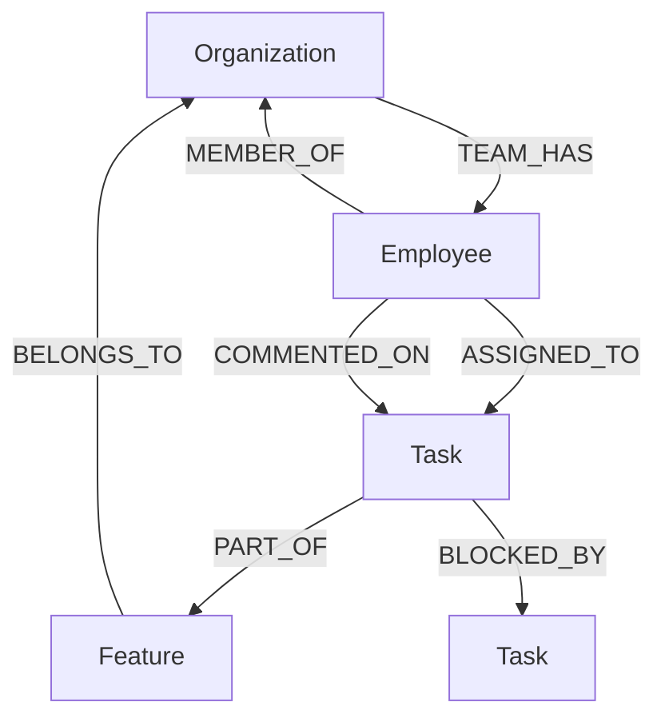

# GraphTask AI — AI-Powered Project & Graph Database Intelligence

[](https://nextjs.org/)
[](https://cognodb.com/)
[](https://ai.google.dev/)
[](LICENSE)

**GraphTask AI** is a minimalistic, high-performance project intelligence dashboard backed by **CognoDB** (a managed graph database speaking openCypher over Bolt) and powered by an **Agentic Google Gemini LLM Tool-Calling AI Assistant**.

---

## 🎯 Why GraphTask AI is Required

In modern software organizations, discovering *who* is working on *what*, tracking recursive task dependency blockages, and assessing project risks requires navigating complex webs of tasks, features, employees, and discussion comments.

### ❌ The Relational Database Bottleneck (SQL)
Traditional relational databases rely on foreign keys and heavy `JOIN` operations. Asking multi-hop questions like:
> *"What downstream features will be delayed if database migration is blocked?"*
> *"Which tasks assigned to Yash have recent comments about OAuth token rotation?"*

requires writing 4 to 5 nested SQL `JOIN` statements. As database tables grow into millions of rows, these JOINs degrade performance exponentially.

### ✅ The Graph Database Solution (CognoDB)
In **CognoDB**, entities are **Nodes** and relationships are **Edges** stored as direct memory pointers.
* Multi-hop path traversals follow index-free pointers in constant time $\mathcal{O}(1)$ per hop.
* Recursive blockage chains (`-[:BLOCKED_BY*1..5]->`) are resolved natively in a single Cypher query.

---

## ✨ Additional Value Delivered to Teams

1. **Agentic Conversational Intelligence ("Plan with AI")**:
   - Teammates can converse with their organization's knowledge graph using natural language.
   - Powered by **Google Gemini API** (`gemini-2.5-flash`).
   - The LLM acts as an intent planner that dispatches authorized backend tools (`search_tasks`, `get_user_activity`, `get_task_details`, `create_task`).
2. **Multi-Tenant Security Enforcement**:
   - The LLM **never touches CognoDB directly** and **never writes raw Cypher**.
   - The backend extracts `companyName` directly from the authenticated user's JWT token, binding it to every Cypher query to guarantee 100% data isolation between companies.
3. **Streamlined Monochromatic UI/UX**:
   - Modern Linear/Apple minimalist design system (`zinc-*` color palette, fine borders, standardized vertical heights, SVG icons).
   - 2-column task grid cards, identity member directory, and Notion-style detail view with live status pills and comment threads.

---

## 📐 Graph Data Model



### Node Labels & Properties
* **`Organization`**: `{ name, status, teamSize, createdAt }`
* **`Employee`**: `{ name, role, password, createdAt }`
* **`Task`**: `{ id, title, description, priority, status, startDate, dueDate, createdAt }`
* **`Feature`**: `{ name, code, description }`

---

## 🗝️ Test Credentials & Seeding

The database comes pre-seeded with multi-tenant mock companies:

| Company Name | User Name | Role | Password |
| :--- | :--- | :--- | :--- |
| **Wexa.ai** | Admin | Admin | `admin123` |
| **Wexa.ai** | Yash | Lead AI Engineer | `yash123` |
| **Wexa.ai** | Alice | Lead Frontend Engineer | `alice123` |
| **Wexa.ai** | Bob | Backend Engineer | `bob123` |
| **Acme Tech** | Sarah | Tech Lead | `sarah123` |
| **Nexus FinTech**| Admin | Admin | `admin123` |

---

## ⚡ Quick Start & Run Instructions

### 1. Prerequisites
- Node.js 18+ installed
- CognoDB Cloud free instance connection parameters (`COGNODB_URI`, `COGNODB_USER`, `COGNODB_PASSWORD`)

### 2. Environment Setup (`.env.local`)
Create `.env.local` in the project root:
```env
# CognoDB Graph Database
COGNODB_URI=bolt+s://<your-instance>.databases.cognodb.com
COGNODB_USER=neo4j
COGNODB_PASSWORD=your_cognodb_password

# Authentication & AI
JWT_SECRET=your_jwt_secret_key_2026
GEMINI_API_KEY=your_google_gemini_api_key
GEMINI_MODEL=gemini-2.5-flash
```

### 3. Seed Database & Start Application
```bash
# Seed CognoDB graph data
node seed.js

# Run Next.js dev server
npm run dev
```
Open [http://localhost:3000](http://localhost:3000) in your browser.

---

## 📖 Further Documentation
For detailed engineering specs, tool calling workflows, and query architectural breakdowns, refer to [architecture.md](file:///Users/yashgoswami/Documents/projects/assignment/architecture.md).
